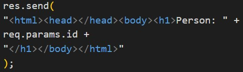

# Práctica 9: Ruteo

> Primera Parcial

- FACULTAD DE TELEMATICA
- INGENIERÍA EN SOFTWARE
- “4ºG”
- PROGRAMACIÓN WEB
- CATEDRATICO: ULIBARRI IRETA CARLOS
- AGUIRRE ROMERO RAMÓN ALEJANDRO

## OBJETIVO

- Nodemon server
- Express module
- Objetos
- Parametros

> ENTREGA: JUEVES 24 DE MARZO DEL 2022

## INFORMACIÓN ADICIONAL

El siguiente ejercicio tiene como objetivo mostrar la forma en la que podemos establecer más de una ruta para nuestra App de Express, y la forma en la que podemos recuperar información contenida en la colección “params” del objeto “request”

## EXPLICACIÓN DEL PROCESO

1. Crea una carpeta llamada "practica_10"

2. Inicializa NPM con npm init -y

3. Instala los paquete express con npm i express y nodemon con npm install -g nodemon

4. Crea un nuevo archivo index.js

5. Escribe el codigo donde se requiera express y donde una app lo mande a llamar

6. Setteamos el puerto para que escuche el servidor y para que se encuentre en el nodo 3000

7. Se establece la primera ruta que tendra el servidor y que se encontrara en el nodo raiz

8. Ahora en el res.send se colocara las entiquetas de html, head, body y h1 pero dentro de h1 debera tener Hello World!
   

9. Se levanta el servidor y lo pone a escuchar

10. Ahora se ejecuta el comando “npx nodemon” en la terminal

11. Abre una nueva ventana en el navegador y escribe localhost:3000 para poder observar el Hello World!

12. Se establece la Segunda ruta que tendra el servidor y que se encontrara en el directorio api (esto se colocara antes de la linea con la que se lenvanta el servidor), lo que regresara esta ruta es un objeto con el nombre y apellido

13. Ahora en el navegador, en el directorio api se podra observar el objeto creado en la segunda ruta

14. Se establece la Tercera ruta que tendra el servidor y que se encontrara en el directorio person (esto se colocara antes de la linea con la que se lenvanta el servidor), esta ruta recibira un parametro por lo que se le coloca /:id despues de colocar el directorio person

15. La manera en la que se utiliza el parametro recibido es de la siguiente manera:
    

- En la primera linea se especifica la parte inicial del html ademas del inicio del texto que se imprimira
  
- Despues se le une el parametro que se recibe
  
- El la tercera fila se cierra el html
  

## RECURSOS

- https://www.npmjs.com/
